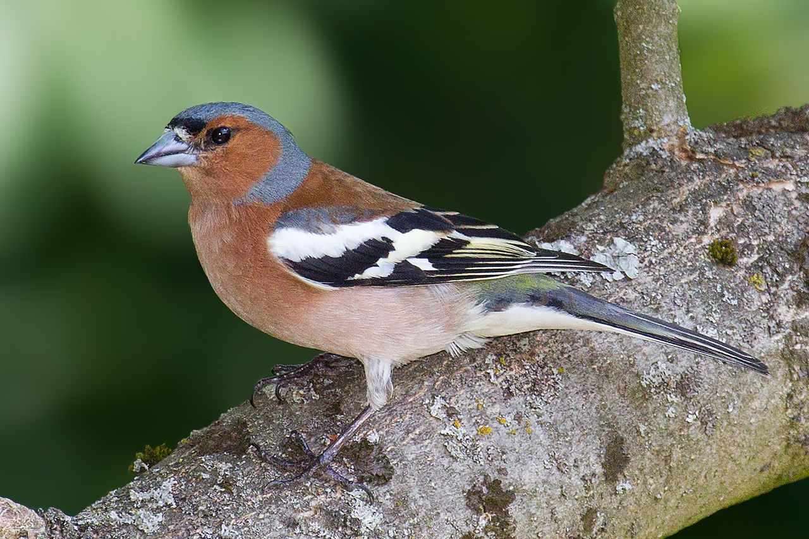

```{r setup, include=FALSE}
knitr::opts_chunk$set(echo = FALSE,
                      warning = FALSE,
                      message = FALSE,
                      fig.retina = 3)
```

```{r packages}
library(tidyverse)
```

#Introduction
Comparison of mass between male and female Chaffs. The average mass of chaffinches is 24g [@noauthor_undated-ne]. Ornithologists have studied chaffinches for hundreds of years [@Turner_undated-jq]. They are even found in places such as the Canary Islands [@GarciaDelRey2005-da].
The males of the species are more colourful than the females. See Figure \@ref(fig:male-fig.)

(ref:male-fig) The males are very colourful. By Andreas Trepte. https://en.wikipedia.org/wiki/Common_chaffinch#/media/File:Chaffinch_(Fringilla_coelebs).jpg 

```{r male-fig, out.height="200px", fig.cap='(ref:male-fig)'}

```


#Methods
Tidy the data and calculate averages.

```{r}
#read in data
file <- read.table("chaff.txt", header = TRUE)

#tidy the data
write.table(file,
quote = FALSE,
row.names = FALSE)

# library tidyverse 
library(tidyverse)
chaff2 <- pivot_longer(data = file, cols = everything(),
                       names_to = "sex", values_to = "mass")
str(chaff2)

#calculate SS(x)
sum_sq <- function(df, measure, group) {
  df %>% group_by ({{ group }}) %>% 
    summarise(ss = sum(({{measure}} - mean({{measure}}))^2))
}

sum_sq(chaff2, mass, sex)

#summarising data
chaff_summary <- chaff2 %>% 
  group_by(sex) %>%
  summarise(mean_index = mean(mass),
            n = length(mass),
            sd = sd(mass),
            se = sd/sqrt(n))
str(chaff_summary)

#create a function
chaff_summary <- function(summarise) {{chaff2 %>% 
  group_by(sex) %>%
  summarise(mean_index = mean(mass),
            n = length(mass),
            sd = sd(mass),
            se = sd/sqrt(n))}}
str(chaff_summary)
```

#Results 
The difference in masses by sex. The *SS(x)* values for *females* is **86.8320**, whilst for *males* it is **87.8975**.
Summary of data shows a *mean* of **20.48** for *females* and **22.28** for *males*. *standard deviation* for *males* is **2.15**  and *standard error* of **0.481**. 
*Females* have a *standard deviation* of **2.14** and a *standard error* of **0.478**.

#Discussion
*Males* are heavier than *females*.

#References 
